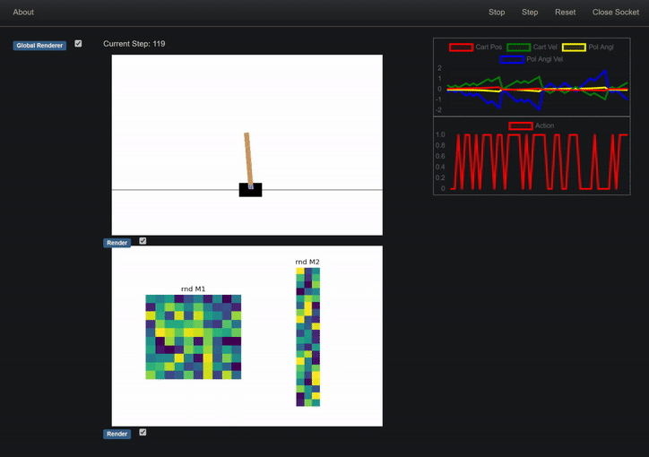

## Browser Dashboard


A simple and modular dashboard that runs directly in the browser. Ideal for headless servers.
This was designed to be used in conjunction with OpenAI Gym Environments. However, I have now used many times with in totally different scenario, so I am dropping the "Gym" from the name. You can still use it with Gym Envs if you want to! But you can do much more with this.


This is _not_ designed to be used during training, but as a tool for analysing the behaviour of some agents in details, through the help of dynamic visualization.

It uses [FastAPI](https://fastapi.tiangolo.com/) web framework and plots stuff through [WebSocketing](https://en.wikipedia.org/wiki/WebSocket). WebSocket uses TCP so you might get some lag. Feel free to re-make this with webRTC if you fancy!

#### Requirements:
`pip install fastapi "uvicorn[standard]"`

I suggest also installing `gym` if you want to try the example:

`pip install gym`


### Installation
To install you can _either_:
- run `pip install git+https://github.com/ValerioB88/browser-dashboard.git`

**OR**
- clone/fork the repo, then install in editable mode (do this if you plan to change stuff): `pip -e {cloned folder}`  
 
### Usage 
The best way to getting started is to take a look at the example: `examples/canvas_and_charts.py`. 

Run it with:
`cd {repo folder}; python -m examples.canvas_and_charts`. The script will try to use the first available port starting at `8000`. Open your browser at `localhost:8000` (or the used port, indicated in the output of the console).

**If you are running the script on a server**, you need to do port forwarding. Open a new terminal on your local machine and type `ssh -L {portnum}:localhost:{portnum} {username}@{machinename}`, e.g. `ssh -L 8000:localhost:8000 val@titan.it`. Then open the browser at `localhost:8000`, and you should see the dashboard.

**TIP**: if the simulation seems to lag, try to hit `Reset` on the dashboard once. For some reason the first run is laggy, then it goes pretty smooth.

### Model
To run your own agent and your own environment (in this example is a gym environment,but doesn't need to), you need to wrap both of them in a subclass of `Model`. This must contain the methods `__iter__` and `stop`. Critically, `__iter__` needs to return an iterator. This is an example of a model for any gym environment (passed through the `env` parameter):

```python
class DummyGymModel(Model):
    action = 0
    def __init__(self, env):
        self.env = env
        self.obs, _ = self.env.reset()

    def __iter__(self):
        while True:
            self.action = np.random.randint(0, 2)
            self.obs, _, termination, _, _ = env.step(self.action)
            if termination:
                self.obs, _ = env.reset()
            yield None

    def stop(self):
        env.reset()
```
(in a real life scenario, this class will also contain a neural network for taking the action).
It should be simple to adapt your own code to this setup. 

### Modules 
To plot stuff in the browser you use `Modules`. I provide some basic ones in `modules/`.  Each module consists of a Python and Javascript file. The Python file generates the data that are passed to the Javascript objects, which plots the data in the browser. 
The `Canvas` and `LinePlot` modules are highly flexible. In fact, you can do most stuff by just subclassing on of the two. 

#### Canvas
The `Canvas` module plots an image in the middle of the page. This could be the openAI rendering (`RenderGymEnv` module) or any other image (e.g. a matplotlib figure, `RandomMatrix` in the example). You can also plot a `StaticImage` which won't be updated. 

Writing new `Canvas` is extremely easy. You can see how simple is to plot something new by looking at the `RenderGymEnv` class: 

```python
class RenderGymEnv(Canvas):
    def render(self, model):
        canvas = model.env.render()
        canvas = Image.fromarray(canvas)
        return PIL2base64(canvas)
```


The `Canvas` module always expects the render output to be a `base64` string. You can convert a PIL image with `PIL2base64`. If you have a matplotlib fiugre use the `fig2PIL` and then the `PIL2base64` (as in the `RandomMatrix` class).

You can also decide where to put the each canvas with the `location` parameter (not implemented for `LinePlot` yet).

#### LinePlot
The `LinePlot` module produces line plots, but it can also produce scatter plots if `show_lines` parameters is set to `False`. I use [Chart.js](https://www.chartjs.org/), and I provide a couple of pre-made lineplots: one for plotting the observations and the other for plotting the taken action. The `LinePlot` Javascript object expects the data to be in the format `[[{'x': 0, 'y': 1}, {'x': 10, 'y': 1}]]`, where the nested list is used because you can potentially have multiple lines in the same plot. You can either return this format directly or use the `AddLineChart` object, which will assume that each time you pass values to render, the `x` step needs to be incremented. You can use it in this way:
```python
AddLineChart(names=['action'], render=lambda m: [m.action], location='right')
```


### Acknowledgement
To develop the UI, I learnt a lot from the [Mesa](https://mesa.readthedocs.io/en/latest/) project, which is however written in [tornado](https://www.tornadoweb.org/en/stable/). You can still see the Mesa footprint in the UI layout :)
