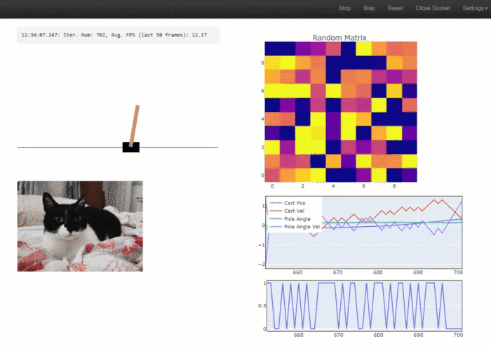
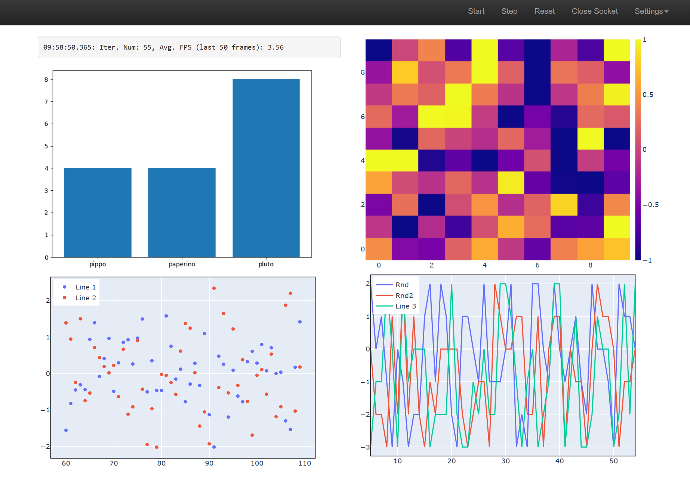
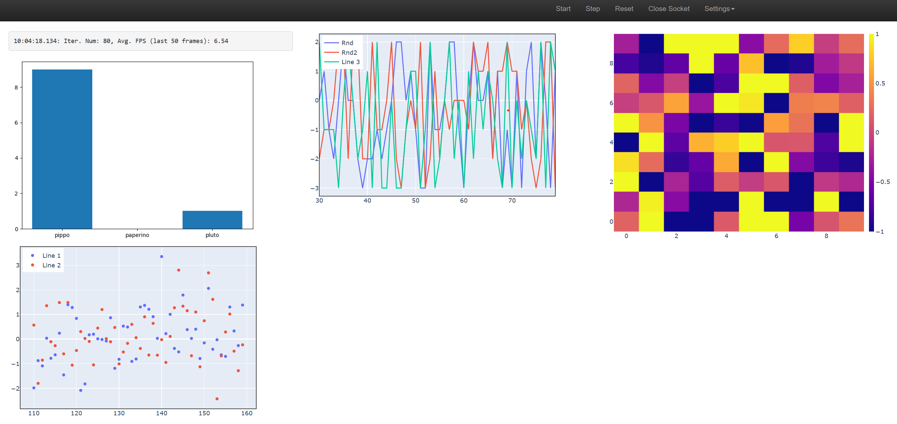

## SimplePyDash


**SimplePyDash** is a versatile, browser-based dashboard designed for real-time data plotting. With a focus on simplicity, it allows Python developers to easily visualize data streams without complex setup or dependencies.

Although originally developed to facilitate real-time plotting of OpenAI Gym environments for observing agent behavior, the versatility of SimplePyDash extends its utility beyond this use case, making it an excellent tool for many other data visualization scenarios.

Under the hood, SimplePyDash leverages the [FastAPI](https://fastapi.tiangolo.com/) web framework and uses [WebSocket](https://en.wikipedia.org/wiki/WebSocket) for bidirectional communication.

### Requirements:
Use the following command to install necessary dependencies:
```
pip install fastapi "uvicorn[standard]"
```
For working with OpenAI Gym environments, install the `gym` library using the command:
```
pip install gym
```
Note: This library is only needed for running the `examples/openai_gym.py` example and is otherwise not mandatory.

### Installation
To install SimplePyDash, you can _either_:

- Install directly from the repository:
```
pip install git+https://github.com/ValerioB88/browser-dashboard.git
```
**OR**
- Clone/fork the repository, and install in editable mode (recommended if you plan to modify the code):
```
pip install -e {path_to_cloned_folder}
```

### Examples 
The best way to get started is to explore the examples provided. `examples/openai_gym.py` demonstrates plotting a gym environment (requires the `gym` library), while `examples/generic.py` is a more general use case.

To run an example, navigate to the repository folder and execute the Python module:
```
cd {path_to_repo_folder}
python -m examples.gym
```
The script will try to use the first available port starting at `8000`. Open your browser and visit `localhost:8000` (or another port if indicated in the console output).

**If you are running the script on a server**, port forwarding will be necessary. Open a new terminal on your local machine and type:
```
ssh -L {portnum}:localhost:{portnum} {username}@{machinename}
```
For example:
```
ssh -L 8000:localhost:8000 val@titan.it
```
Then, open your browser and visit `localhost:8000` to view the dashboard.

## Quick Start 
SimplePyDash organizes your dashboard into columns (2 by default). The `CustomAPI` object takes a `model_obj` and a series of `DashboardComponents`. The user-defined `model_obj` is a simple iterator performing the computations (e.g., running a neural network and returning an action). `DashboardComponents` are widgets that can be displayed in the browser.

SimplePyDash includes several default widgets, including `HeatMap`, `LinePlot`, `StaticImage`, `TextInfo`, and `RenderGymEnv`. The `plot` widgets, such as `HeatMap` and `LinePlot`, are based on the [Plotly](https://plotly.com/python/) graphics library, allowing for easy addition of Plotly graphs to your widget list.

Here's a basic example of a `CustomAPI` object:
```python
server = CustomAPI(
    model_obj=DummyModel,
    dash_comps=[
        GeneralTextInfo(location_col_idx=0, use_scroll=False),
        MatplotlibPlot(location_col_idx=0, width=500),
        AppendScatterPlot(
            get_new_data_fun=lambda m: np.random.randn(2, 2).tolist(),
            location_col_idx=0,
            mode="markers",
            width=500,
            height=350,
        ),
        HeatMap(
            get_new_data_fun=lambda m: m.rnd_matrix,
            clr_min=-1,
            clr_max=1,
            location_col_idx=1,
            height=420,
        ),
        AppendScatterPlot(
            legends=[
                "Rnd",
                "Rnd2",
            ], 
            get_new_data_fun=lambda m: m.rnd_lines.tolist(),
            location_col_idx=1,
            width=500,
            height=350,
        ),
    ],
    model_params=dict(num_lines=3),
)

```
 
We'll talk about the `model_obj` in a second. For now consider the `dash_comps` (DashComponents). We provide 5 components: a Text Box, a matplotlib Barplot, a HeatMap, a Scatter plot and a Line plot. Notice that the using matplotlib is discouraged in favour of Plotly, but here we show that it's possible to integrate matplotlib plots within your dashboard.
 `SimplePyDash` automatically arranges these 5 components in 2 columns, as specified by the fact that their `location_col_idx` is 0 and 1:


 If the `location_col_idx` of the `HeatMap` was `=2`, this would automatically create 3 columns:
 
 Notice that the order in which the widgets are placed in a column corresponds to the order they are passed to `dash_comps`. 

Each `DashComponent` will have a default `width` and `height`. However, you can modify one or both of them to make the widget bigger or smaller. This will not resize the whole column. When using more than 2 columns, `SimplePyDash` will automatically span the whole page, otheewise it will center the columns in the middle of the page. You can control this behaviour by passing `wide_page=True/False` to `CustomAPI`. 

### Model
The `Model` must be an infinite iterator that performs computations for the data you want to plot. Take the `DummyModel` used in `examples/generic.py`: 

```python
class DummyModel(Model):
    tot_steps = 0

    def __init__(self, num_lines, **kwargs):
        self.num_lines = num_lines
        super().__init__(**kwargs)

    def __iter__(self):
        while True:
            self.rnd_matrix = np.random.randn(10, 10)
            self.rnd_lines = np.random.randint(-3, 3, (self.num_lines, 1))

            self.tot_steps += 1
            yield None

    def stop(self):
        pass
```
In a real life scenario, this class would perform the computation that you want to plot. For example, it might contain a neural netwok, one or several RL agents, etc. For an example with OpenAI Gym Environment, check `examples/openai_gym.py`.

### Plotly Components
`HeatMap` and `AppendScatterPlot` are Plotly components. `AppendScatterPlot` can be used both for scatter and line plots: just pass the argument `mode='markers'` for a scatter plot and `mode='lines'` for a line plot (this is following Plotly convention). these are Plotly figures which are passed to the web browser. Implementing a new plotting component just a bit more effort than creating a new Plotly plot: each component needs to implement a `render` function which specifies what to do with the figure at each iteration. For `HeatMap` and `AppendScatterPlot`, the `render` function calls a user-provided `get_new_data_fun` which takes some data and use them to update the Plotly figure. In this way the `AppendScatterPlot` and `HeatMap` are general and can be used for any model.  However, you can create your own `PlotlyComponent` that simple plots some data specific to your own model. This is easy, since `render` has access to the whole model object, so that you can do something like `self.fig.data[0].z = model.agents[0].energy_level`. . 

#### Canvas
The `Canvas` module returns an image for rendering animations made of individual images in the browser. This could be an OpenAI rendering (using `RenderGymEnv` module) or any other image (e.g., a matplotlib figure, a static image, etc.).

To extend `Canvas`, simply create a new class that overrides the `render` method. For instance, the `RenderGymEnv` class is defined as follows:

```python
class RenderGymEnv(Canvas):
    def render(self, model):
        canvas = model.env.render()
        canvas = Image.fromarray(canvas)
        return PIL2base64(canvas)
```

The `Canvas` module expects the render output to be a `base64` string. A PIL image can be converted to this format using `PIL2base64`. If you have a matplotlib figure, use `fig2PIL` followed by `PIL2base64`. We do not reccomend using matplotlib figures as the aren't as fast as Plotly plots, but the option is there for you. 

### Settings and Performance
Upon running SimplePyDash, you will find a `Settings` dropdown menu in the navigation bar in your web browser. Here, you can specify the desired FPS . Note that while WebSocket will attempt to maintain the specified rate, it's not guaranteed to always match it.

By default, SimplePyDash runs one iteration of the `Model` object, computes the result for each dashboard component, and renders the result in the browser. To boost performance, you can perform multiple `Model` iterations and computations before rendering to the browser. Adjust the `Num. Model Iters x Gfx Update` value in the Settings to do so. This could result in a massive speed up.

Some modern browsers such as Edge use an "Efficiency mode" which will slow down websocket transfer even for tabs that are in the foreground! If you see a sudden slowdown after the first 10 seconds or so, and the slowdown disappears if you interact with the page in any way (random pressing around), it means that the browser is doing performing "optimisations" on your tab. You can prevent this, but it depends on your browser. For example, in Edge, go to Settings->Systems and performance->Never put these sites to sleep and add `localhost:8000`. 

#### What performance should I expect?
Performance will depend on a variety of factors. As a guideline, with 1 iteration per graphic update, I get a FPS of a least 8 with the `examples/generic.py` (which, recall, uses a Matplotlib plot which is not efficient). I get 14 FPS with `examples/openai_gym.py`. Of course, increasing the iterations per update will significantly increase that.